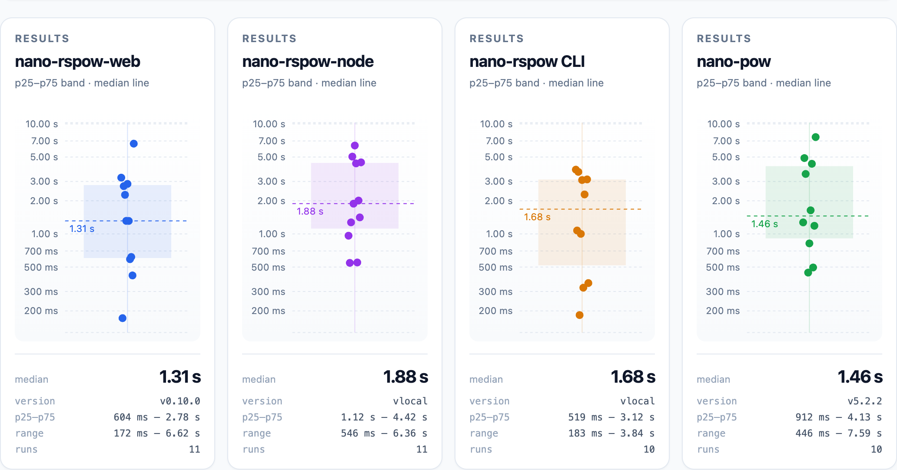

# nano-rspow-web

If you are looking for the same functionality on the server side, see the [nano-rspow-node README](../nano-rspow-node/README.md).

Nano (XNO) proof-of-work generation for browsers using WebAssembly and WebGPU.

Tries WebGPU first, then automatically falls back to single-threaded CPU WebAssembly if WebGPU is unavailable.

## Install

```bash
npm install nano-rspow-web
```

## Usage

```javascript
import init, { generate_work, validate_work } from 'nano-rspow-web';

// Initialize the WebAssembly module
await init();

// Generate work
const hash = "718CC2121C3E641059BC1C2CFC45666C99E8AE922F7A807B7D07B62C995D79E2";
const threshold = "fffffff800000000";

const result = await generate_work(hash, threshold);
console.log("Nonce:", result.nonce);   // e.g., "8587f13863c049fd"
console.log("Is GPU:", result.is_gpu); // true/false

// Validate work
const isValid = validate_work(hash, result.nonce, threshold); // true
```

The threshold argument is always caller supplied. For current Nano mainnet,
use `fffffff800000000` for send/change blocks or `fffffe0000000000` for
receive/open/epoch blocks. Pass the stricter value required by the publishing
node when it differs. See Nano's
[Work Generation guide](https://docs.nano.org/integration-guides/work-generation/)
for current network requirements.

## Benchmarking Dashboards

<table>
<tr>
<td>

<p><strong>Browser-only benchmark:</strong> fully in-browser, benchmarking the <code>nano-rspow-web</code> package's WebGPU and CPU WebAssembly backends.</p>
</td>
<td>

<p><strong>Local comparison results:</strong> requires building and running this repository locally; these post-run charts compare in-browser providers with the server-side <code>nano-rspow-node</code> addon and native Rust CLI side by side.</p>
</td>
</tr>
</table>

Try the browser-only dashboard without building anything:
**[https://casualsecurityinc.github.io/nano-rspow/](https://casualsecurityinc.github.io/nano-rspow/)**

### Running them locally

Everything runs through `make` from the repository root. Run `make help` for the
full list.

**One-time setup, after cloning:**

```bash
make web-prereqs
```

That installs the `wasm32-unknown-unknown` Rust target, builds the
`nano-rspow-node` native addon and installs the dashboard's npm dependencies,
skipping whatever is already satisfied. It is safe to re-run. It needs `cargo`,
`npm` and `python3` on your `PATH`, plus the `wasm-bindgen` CLI, which it does
*not* install for you — that compiles for several minutes, so the script prints
the command instead and exits. Both dashboards need `wasm-bindgen`; the native
addon is the only prerequisite that only the head-to-head dashboard needs, so
`./scripts/setup-web-toolchain.sh --skip-addon` is enough for the browser-only
one.

Verify the toolchain without changing anything with
`./scripts/setup-web-toolchain.sh --check`.

`cargo benchmark-web` also builds and opens the browser-only dashboard. It is a
thin wrapper around the same `build-demo.py`, kept because the root README has
long pointed at it; prefer `make web-demo`, which is the same thing plus the
prerequisite tooling.

**Browser-only dashboard** — measures this package's WebGPU and WASM CPU
backends, nothing else. No server, no addon:

```bash
make web-demo            # builds and opens nano-rspow-web/browser-demo/index.html
make web-demo-build      # same build, no browser launch
make web-demo-check      # is the built page present, complete and current?
```

`index.html` is a single self-contained file — the WebAssembly, the
wasm-bindgen glue and the WGSL shader are all inlined, so it works when opened
straight from disk over `file://`. It is **generated and not committed**,
because a 550 KB committed artifact eventually gets opened after the crate has
moved on and silently benchmarks an old WebAssembly module. If the file is
missing or older than its sources, `make web-demo-check` says so and tells you
to rebuild.

**Head-to-head dashboard** — compares this package against `nano-pow` and
against the `nano-rspow-node` addon and the Rust CLI work peer. It needs the
native addon, which is why it is a separate command:

```bash
make web-compare-run     # builds, then serves on http://localhost:8080/
```

Overrides: `make web-compare-run PORT=8081`, or `WORK_PEER_PORT`,
`WORK_PEER_BACKEND=auto|cpu|gpu`, and `NANO_WORK_URL` to point at a work peer
you are already running. `make web-compare` builds into `dist/` without serving.
`make web-all` builds both, `make web-clean` removes the generated output.

### What CI covers

CI builds and verifies the **browser-only** dashboard only, in the
`browser-demo` job of `.github/workflows/web-browser-tests.yml`. It runs the same
prerequisite script, the same `make web-demo-build`, and then
`scripts/check-browser-demo.sh` — the same check as `make web-demo-check` — so
CI and your machine cannot disagree about what a valid dashboard is.

The head-to-head dashboard is not built in CI because it requires the native
`nano-rspow-node` addon, which is a platform-specific native compile. It is a
local tool, and `make web-compare-run` is the supported way to run it.


## API reference

### `init(moduleOrPath?)`

Initializes the asynchronous WASM loader. Await this default export before calling the work functions. It accepts an optional WebAssembly module, bytes, `Response`, URL, request, or promise for one of those inputs.

### `initSync(module)`

Initializes the module synchronously from bytes or a precompiled `WebAssembly.Module`. Use this only when the module bytes are already available.

### `generate_work(hash_hex: string, threshold_hex: string): Promise<GenerateResult>`
Asynchronously generates Proof of Work for a 32-byte block hash at any hexadecimal threshold. Tries WebGPU first, falling back to CPU WebAssembly.

### `generate_work_gpu(hash_hex: string, threshold_hex: string, cancel_token: WasmCancelToken): Promise<GenerateResult>`
Forces WebGPU PoW generation at any hexadecimal threshold. Rejects if WebGPU is unavailable or if the cancellation token is triggered.

### GPU resource lifetime and concurrency

One WebGPU generator is built per page and reused by every call. Building one
requests an instance, adapter, device and queue, compiles the WGSL shader,
creates the compute pipeline and allocates the double-buffered slots, so
rebuilding it per call charged that whole cost to the caller once per block.
`recommendLocalPow` builds the same generator, which also warms the cache for
the first `generate_work` call.

Two consequences for callers:

- **Generation is serialised.** The generator's ping-pong buffers are shared, so
  overlapping calls would write the same slot and read back each other's
  results, handing back work computed for a different block. Calls are
  therefore queued and run one at a time, in the order they arrive. Concurrent
  calls are safe but wait their turn; they are never rejected or interleaved.
- **A lost device is recovered automatically.** If the browser drops the
  device, the cached generator is discarded and the next call builds a new one.

### `generate_work_cpu(hash_hex: string, threshold_hex: string): GenerateResult`
Synchronously generates PoW at any hexadecimal threshold, forcing single-threaded CPU WebAssembly.

### `generate_work_cpu_batch(hash_hex: string, threshold_hex: string, max_nonces: number): string | null`

Tests at most `max_nonces` nonces synchronously on the CPU. Returns a lowercase 16-character nonce when found, otherwise `null`. The CPU random-number-generator state persists between calls. Pass an unsigned 32-bit integer.

### `recommendLocalPow(reprobe = false): Promise<boolean>`

Returns whether this browser should prefer local PoW. On a cache miss it tests
WebGPU capability, or the single-threaded WASM CPU fallback's throughput. The
result is cached internally. Pass `true` to force a fresh evaluation after a
hardware or browser capability change.

### `validate_work(hash_hex: string, nonce_hex: string, threshold_hex: string): boolean`
Synchronously validates whether a nonce meets an arbitrary hexadecimal threshold for the given block hash.

### `WasmCancelToken`
A class utilized to signal cancellation to the asynchronous GPU solver loop.
* `new WasmCancelToken()`: Instantiates a new token.
* `cancel()`: Aborts the ongoing GPU compute loop.

### `GenerateResult`

Returned by all generation functions.

* `nonce: string`: Lowercase 16-character hexadecimal nonce.
* `is_gpu: boolean`: `true` when WebGPU found the nonce.
* `free()` or `[Symbol.dispose]()` releases the WebAssembly wrapper when manual resource cleanup is needed.


---

## Browser compatibility

Use a browser with WebGPU support to use the GPU path. Browsers without WebGPU use the synchronous single-threaded WebAssembly CPU fallback.


- **[nano-rspow-node](https://www.npmjs.com/package/nano-rspow-node)**: High-performance pre-compiled Node.js bindings for backend servers.
- **[nano-rspow Workspace](https://github.com/CasualSecurityInc/nano-rspow)**: The monorepo source code containing both packages.
