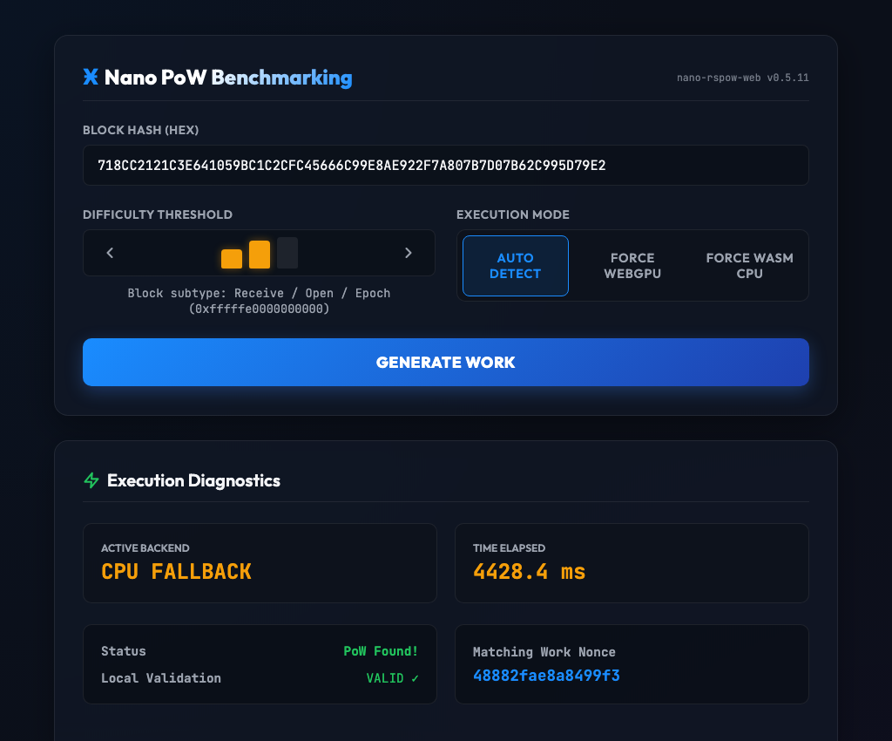

# nano-rspow-web

WebGPU-accelerated Nano (XNO) Proof-of-Work generation in the browser using WebAssembly. Pre-compiled for high-performance direct web browser integrations.

Tries WebGPU first, then automatically falls back to single-threaded CPU WebAssembly if WebGPU is unavailable.

## Install

```bash
npm install nano-rspow-web
```

## Usage

```javascript
import init, { generate_work, validate_work } from 'nano-rspow-web';

// Initialize the WebAssembly module
await init();

// Generate work
const hash = "718CC2121C3E641059BC1C2CFC45666C99E8AE922F7A807B7D07B62C995D79E2";
const threshold = "fffffff800000000";

const result = await generate_work(hash, threshold);
console.log("Nonce:", result.nonce);   // e.g., "8587f13863c049fd"
console.log("Is GPU:", result.is_gpu); // true/false

// Validate work
const isValid = validate_work(hash, result.nonce, threshold); // true
```

## Benchmarking Dashboard


An interactive benchmarking dashboard is included in `browser-demo/index.html` to measure WebGPU and CPU WebAssembly performance.

Try it out for yourself: **[https://casualsecurityinc.github.io/nano-rspow/](https://casualsecurityinc.github.io/nano-rspow/)**

<br clear="right" />


## API Reference

### `init(module_or_path)`
Initializes the WASM loader. Must be awaited before calling other functions.

### `generate_work(hash_hex: string, threshold_hex: string): Promise<GenerateResult>`
Asynchronously generates Proof of Work for a 32-byte block hash. Tries WebGPU first, falling back to CPU WebAssembly.

### `generate_work_gpu(hash_hex: string, threshold_hex: string, cancel_token: WasmCancelToken): Promise<GenerateResult>`
Forces WebGPU PoW generation. Rejects if WebGPU is unavailable or if the cancellation token is triggered.

### `generate_work_cpu(hash_hex: string, threshold_hex: string): GenerateResult`
Synchronously generates PoW forcing single-threaded CPU WebAssembly.

### `validate_work(hash_hex: string, nonce_hex: string, threshold_hex: string): boolean`
Synchronously validates whether a nonce meets the difficulty threshold for the given block hash.

### `WasmCancelToken`
A class utilized to signal cancellation to the asynchronous GPU solver loop.
* `new WasmCancelToken()`: Instantiates a new token.
* `cancel()`: Aborts the ongoing GPU compute loop.


---

## Browser Compatibility

WebGPU works correctly in all major browsers including Chrome, Brave, Edge, and Safari.


- **[nano-rspow-node](https://www.npmjs.com/package/nano-rspow-node)**: High-performance pre-compiled Node.js bindings for backend servers.
- **[nano-rspow Workspace](https://github.com/CasualSecurityInc/nano-rspow)**: The monorepo source code containing both packages.
